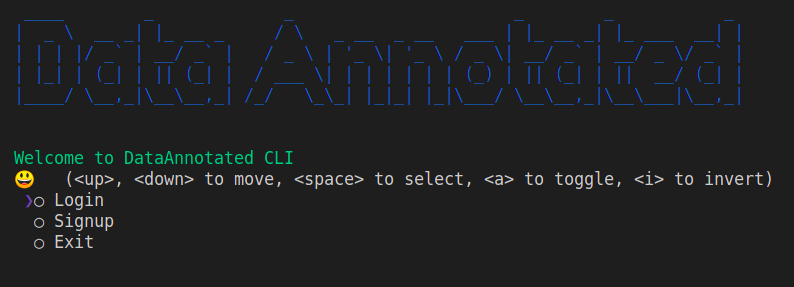

<p align="center">
  
   
</p>
<h1 align="center" style="font-weight:bold">
    DataAnnotated Python Package
</h1>

<p align="center">
A python package for DataAnnotated platform to provide seamless integration between data in annotation and data in development.
</p>

<p align="center">


</p>

<p align="center">

</p>


<h2 align="center" style="font-weight:bold">
Installation
</h2>

Install the package using pip and the best case scenario is to work on a sepearate virtual environment. Install `conda` to create a virtual environment for development.

```bash
$ conda create --name data_annotated python=3.7.9
$ pip install DataAnnotated==1.0.0
```

First time users have to setup the connection to their account my logging in with the following command.

```bash
$ python -m DataAnnotated
```



Once you are logged in, you can use the features of the package such as to view, get dataset from the platform **realtime!**

